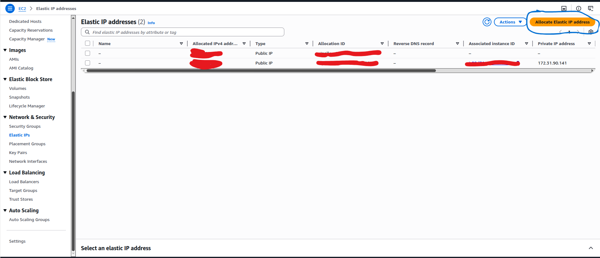
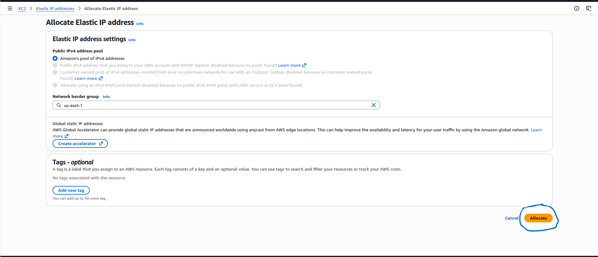
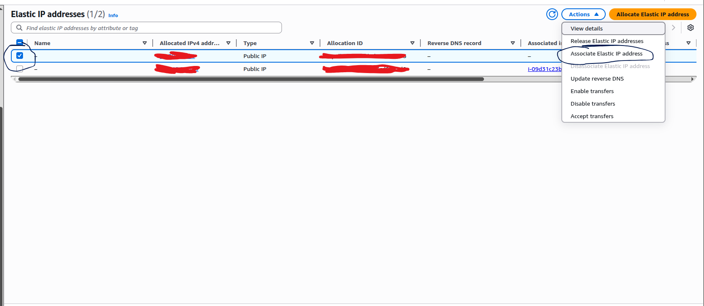
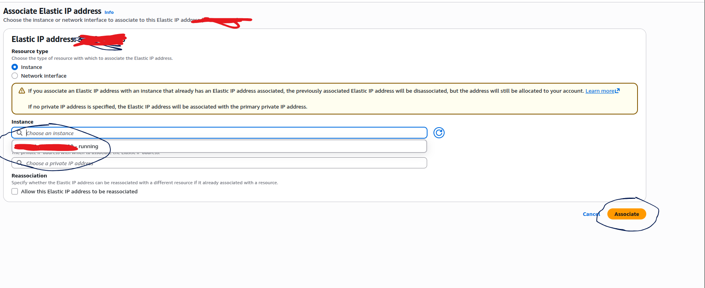
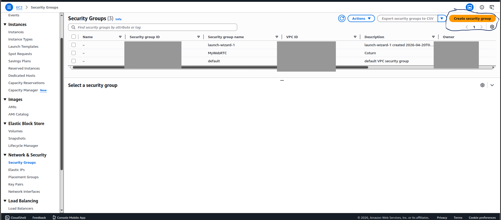
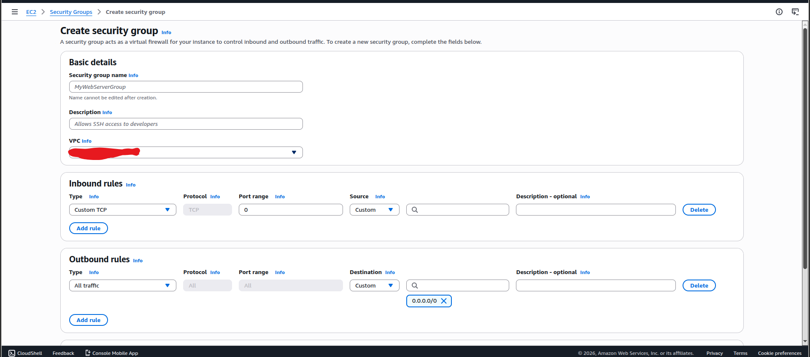
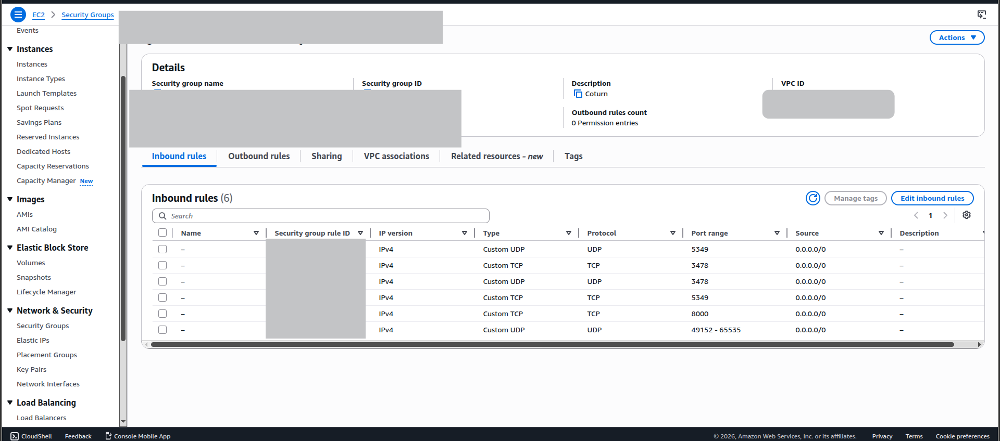
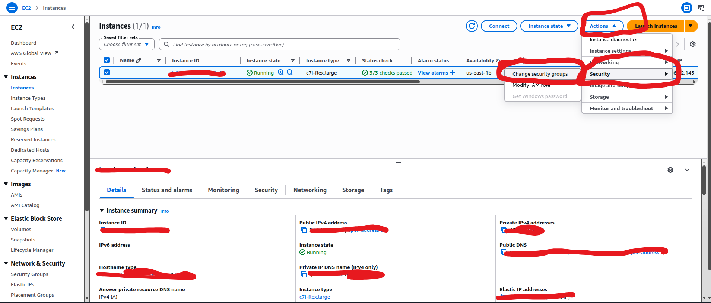
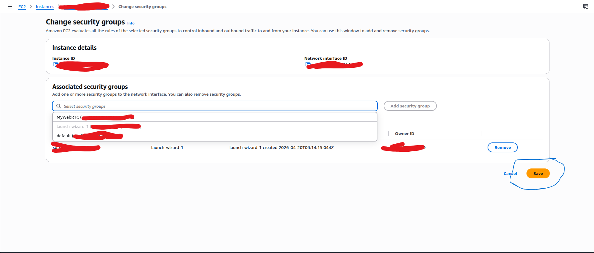
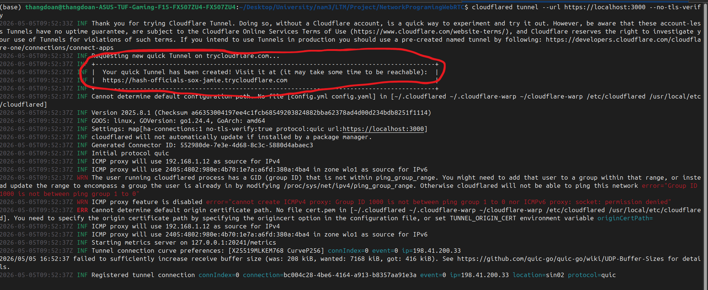

# Hệ Thống Video Call WebRTC (Mesh Architecture)

## 1. Yêu cầu hệ thống

1. Cài đặt **Node.js** (phiên bản 14+).
2. Tải hoặc clone thư mục của dự án và cài đặt các thư viện cần thiết:
   ```bash
   npm install
   ```

---

## 2. Cách tạo chứng chỉ SSL (Certs)
API của trình duyệt (`getUserMedia`) để gọi Camera và Micro yêu cầu trạng thái an toàn bảo mật, do đó phải sử dụng **HTTPS / WSS** (kể cả localhost). 

Cần tạo chứng chỉ tự ký như sau:
1. Tạo thư mục `certs` tại thư mục root của dự án (cùng cấp với `package.json`):
   ```bash
   mkdir certs
   ```
2. Sử dụng công cụ **OpenSSL** để sinh key và cert (bạn có thể chạy trên Git Bash, Linux hoặc MacOS):
   ```bash
   openssl req -nodes -new -x509 -keyout certs/key.pem -out certs/cert.pem -days 365
   ```
*(Bạn ấn `Enter` liên tục ở các thông tin cấu hình mà OpenSSL hỏi. Mã nguồn đang đọc cố định đường dẫn `./certs/key.pem` và `./certs/cert.pem`).*

---

## 3. Chạy Server
Sau khi có chứng chỉ, bạn khởi động máy chủ (bao gồm static Front-End Express và WebSocket server).

```bash
npm install
npm start
```
Terminal sẽ hiển thị server đã được khởi động ở dòng chú ý: `HTTPS + WS chạy tại https://localhost:3000`. 
Mở trình duyệt truy cập url này để vào sử dụng. *(Nếu vào chrome báo đỏ `Your connection is not private`, ấn Advanced -> Proceed to localhost (unsafe).)*

---

## 4. Cấu hình dịch vụ TURN / Chạy Coturn
Phần Front-end (`public/index.html`) đã cấu hình STUN/TURN server ở biến `rtcConfig` hỗ trợ vượt Firewall hay lỗi địa chỉ mạng (NAT Traversal). 

### 4.1 Cấu hình AWS instance
**1 đăng kí tài khoản AWS và tạo 1 instance với ubuntu server**


**2 tạo Elastic IP để có 1 Public IPv4 cố định**

Ở phần network&Security chọn Elastic IP



Nhấn vào **Allocate Elastic IP address**  Lúc này 1 giao diện như bên dưới sẽ hiện ra  , Nhấn Allocate để  cấp phát IP cho server

 

sau khi được cấp Ip thì ở phần etwork&Security chọn Elastic IP , lúc này sẽ hiện ra danh sách IP được cấp phát, chúng ta chọn 1 IP bằng cách nhấn dấu tick và sau đó nhấn action , chọn Assiciate Elastic IP address để tiến hành liên kết IP này với server 
 

Sau đó chúng ta sẽ bước vào giao diện như bên dưới , ở phần instance chúng ta chọn instance tương ứng với turn server của chúng ta , sau đó chọn Associate, lúc này server của chúng ta đã có Public IPv4
 

**3 Tạo security Group**
Ở phần network&Security chọn Security Group , chúng ta nhấn vào Create Security Group để tạo Security Group mới
 
Tiếp theo đó chúng ta thêm các inbound rule, nhấn Add Rule để thêm Rule , chúng ta cần thêm các Rule như sau 
```
{
  "Rule 1": {
    "type": "Custom UDP",
    "protocol": "UDP",
    "Port range": "5349",
    "source": "Anywhere-IPv4"
  },
  "Rule 2": {
    "type": "Custom TCP",
    "protocol": "TCP",
    "Port range": "3478",
    "source": "Anywhere-IPv4"
  },
  "Rule 3": {
    "type": "Custom UDP",
    "protocol": "UDP",
    "Port range": "3478",
    "source": "Anywhere-IPv4"
  },
  "Rule 4": {
    "type": "Custom TCP",
    "protocol": "TCP",
    "Port range": "5349",
    "source": "Anywhere-IPv4"
  },
  "Rule 5": {
    "type": "Custom UDP",
    "protocol": "UDP",
    "Port range": "49152-65535",
    "source": "Anywhere-IPv4"
  }
}
```
 
Sau khi đã tạo xong chúng ta sẽ có Inbound Rule của Security Group như bên dưới 
 

**4 Cấu hình security group cho turn server**
Sau khi chúng ta đã tạo security Group, cần thêm nó vào Turn server 

Ở phần instance chúng ta sẽ có danh sách instance , chọn instance tương ứng với turn server của chúng ta, sau đó chọn action -> security -> change security group

 
Sau khi chọn xong chúng ta sẽ đi đến 1 giao diện như bên dưới 

Ở phần Assocciated security groups chọn security group vừa tạo sau đó nhấn Add Security Group và nhấn Save

 

### 4.2 thiết lập turn server
Sau khi SSH vào server đã thiết lập trên aws tiến hành các bước sau
**cài đặt coturn**
  ```bash
   sudo apt update
   sudo apt install coturn
   sudo systemctl stop coturn
   ```
**Cấu hình file turnserver.conf**
```bash
sudo mv /etc/turnserver.conf /etc/turnserver.conf.backup
sudo nano /etc/turnserver.conf
```
Sau đó dán nội dung sau vào 

nhớ cấu hình user , Vd user = thang:123456 nghĩa là username là thang , credentical là 123456

relay-IP là Ip private của aws server, có thể xem bằng lệnh **hostname -I**

external-ip là Elastic IP vừa dc cấp phát
```
# --- Cấu hình chung ---
fingerprint
# Thay bằng tên miền hoặc IP Public của bạn
realm=my-turn-server
server-name=turn-server

# --- Ghi log ---
log-file=/var/log/turnserver/turnserver.log
no-loopback-peers
no-multicast-peers

# --- Xác thực ---
# Lưu ý: nếu dùng static-auth-secret thì bỏ comment dòng này và bỏ qua dòng 'user='
# static-auth-secret=your_secret_key_here
user=<USER>:<PASSWORD>
lt-cred-mech
cli-password=<PASSWORD>

# --- Cấu hình IP (Dùng cho AWS/Cloud) ---
listening-ip=0.0.0.0
# IP private của server AWS (VD: 172.31.90.141)
relay-ip=<Private IP>
# IP Public của server AWS
external-ip=<ELASTIC IP>

# --- Cổng (Phải khớp với Security Group) ---
min-port=49152
max-port=65535

# --- Cấu hình an toàn ---
# Tạm thời để mặc định, nếu sau này có SSL thì cấu hình thêm
# Bạn có thể bỏ comment nếu muốn bắt buộc dùng TLS/DTLS
# tls-listening-port=5349
# cert=/etc/letsencrypt/live/yourdomain/fullchain.pem
# pkey=/etc/letsencrypt/live/yourdomain/privkey.pem

```
**Chạy turn server**
```
sudo systemctl start coturn
sudo systemctl enable coturn
```
3. Sau khi máy chủ chạy thành công, nhớ sửa lại IP và Port trong `public/index.html` của dự án ở dòng 
```
const rtcConfig = {
    iceServers: [
        { urls: 'stun:stun.l.google.com:19302' },
        { 
            urls: 'turn:<Elastic IP của turn server>:3478', 
            username: <USER>, 
            credential: <PASSWORD> 
        }
    ]
    //  ],
    //  iceTransportPolicy: "relay"  //
};
```
---


## 5. Demo public qua Cloudflare Tunnel
Để cho phép thiết bị hoặc thành viên khác trên môi trường internet kết nối thử nghiệm, chúng ta sẽ hướng public host `localhost:3000` ra ngoài bằng `cloudflared`.

1. Cài đặt [cloudflared](https://github.com/cloudflare/cloudflared/releases) ở máy chạy Node.js server.
2. Mở cmd kết nối Tunnel trỏ vào HTTPS port `3000` cùng với thông số `--no-tls-verify` do chúng ta đang dùng self-signed cert.
   ```bash
   cloudflared tunnel --url https://localhost:3000 --no-tls-verify
   ```
3. Tunnel sẽ sinh thành công một đường link ở logs vd như `https://xxxxxx.trycloudflare.com` như trong hình. Gửi URL đó cho các thành viên cần test hệ thống. 
 

---

## 6. Hướng dẫn Test luồng WebRTC

* **Test Gọi Nhóm 2 người (1v1):**
  1. Trên 2 máy / thiết bị (hoặc 2 tab trình duyệt ẩn danh) truy cập vào host.
  2. Tại trang (Login), nhập tên khác nhau nhưng cấu hình cùng chung **ID phòng** (VD: `testroom`).
  3. Ấn "**Vào phòng**" – sau đó hệ thống sẽ hỏi quyền cấp media, hãy xác nhận Cho Phép Camera/Micro.
  4. Một người chủ động (Hoặc bất cứ ai) bấm nút "**Call phòng**". Máy sẽ xử lý đẩy Offer thông qua Signaling WS đến người còn lại – bắt tay thành công lập tức lên 2 khung video cho nhau.

* **Test Gọi Đa Chiều (Nhóm 3–4 người):**
  1. Làm các bước tương tự bằng cách yêu cầu 3-4 người / thiết bị cùng gia nhập dưới 1 tên **ID phòng** duy nhất.
  2. Bất kì một người kích hoạt call bằng nút "**Call phòng**". 
  3. Với kiến trúc Multi-peer P2P, thiết bị của người bấm sẽ lần lượt sinh `RTCPeerConnection` và gửi trao đổi Offer với N-1 phần tử trực tuyến còn lại trong array member của websocket.
  4. Tại máy bạn sẽ thấy xuất hiện lần lượt từ 2, 3 và 4 box video call đồng thời trực tiếp mà không cần SFU hay MCU ở trung gian xử lý media! Mạng và phần cứng của người test sẽ được đo bằng số lượng Peer.